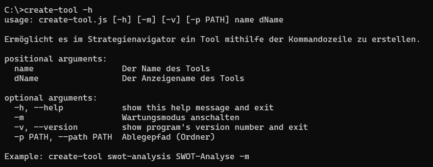

# stratnavi-create-tool
Ermöglicht es im Strategienavigator ein Tool mithilfe der Kommandozeile zu erstellen.

### Usage


### Example
```shell
create-tool swot-analysis SWOT-Analyse -m
```

### Mindestanforderungen
Gebrauchte NodeJS Version: min **v.18.16.0**